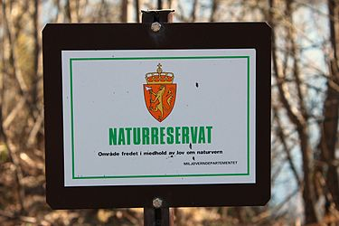
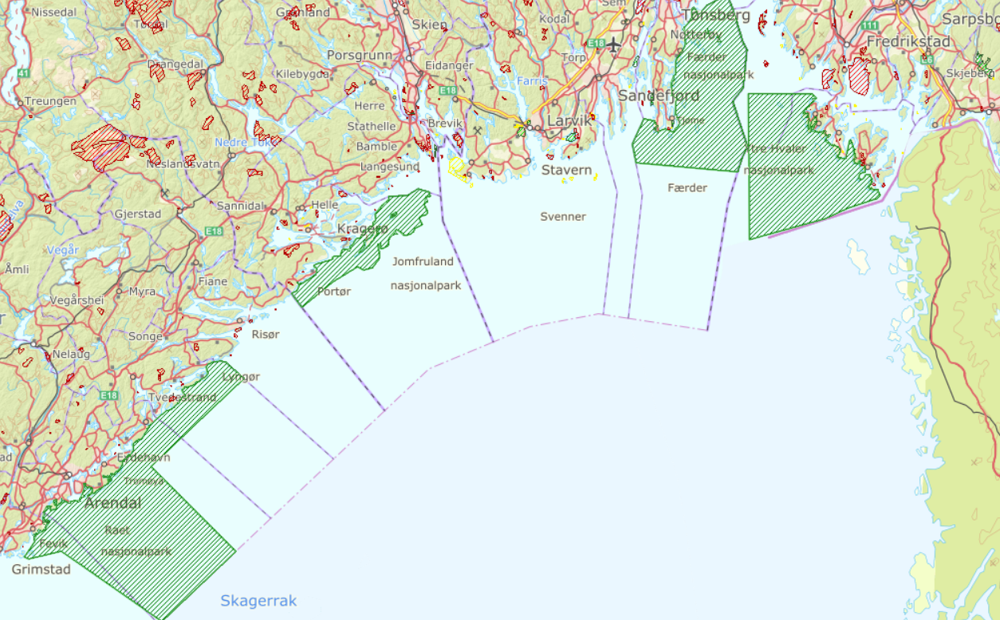

Vær oppmerksom på at i tillegg til nasjonalparker i fjellet, har vi nå fått fire vernede områder langs sørlandskysten. Det er også lignende i fjorder på vestlandet. I Sogn & Fjordane er det flere LVO (landskapsvern områder). Jostedalsbreen med Bøyaøyra, Breheimen med Vigdalen og Mørkridsdalen, Jotunheimen og Utladalen, Nærøyfjorden med Bleia-Storebotnen, Bleia og Grånosmyrane har forbud om flyging under 300 meter fra bakken og landing. De mindre naturreservatene har stort sett forbud mot landing. Pass på dette.

[Her er et kart som viser vernede områder ( miljostatus.no )](http://www.miljostatus.no/kart/?ma=1A298) eller denne: [kart.naturbase.no](https://kart.naturbase.no/)\
Klikk på områdene for nærmere info og Lovdata.

Ytre Hvaler, Færder, Jomfruland, Stråholmen og Raet nasjonalparker har restriksjoner med minimum flygehøyde på 300 m. [Les mer](https://www.fylkesmannen.no/Telemark/Miljo-og-klima/Nyheter-fra-Fylkesmannens-miljovernavdeling/Jomfruland-nasjonalpark-er-opprettet/)

